# Coway AP-1512HH [Mighty] Teardown
Information about the hardware of the Coway AP-1512HH Air Purifier. This is not a review. The accuracy of this information cannot be guaranteed.

## Update on Open Source Main Control Board and related has been published!
Update Jun 2, 2024: I have published a design for an open source replacement main PCB. I don't know if I will be able to provide support for it, but it is provided as-is for your use (https://github.com/larryqiann/AP1512HH-ESP32/) 

## Basic information 

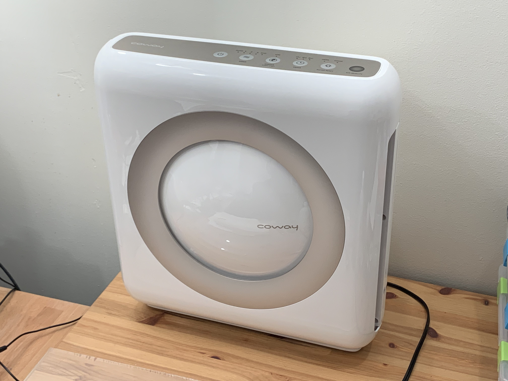

This is a Coway AP-1512HH Air Purifier. I purchased it "used" from Amazon on Feb 19, 2021 for about $230 CAD. It has a three stage filtration system consisting of a pre-filter, followed by a "scotch brite pad" type carbon filter, and a HEPA filter. It also features an ionizer.

The air purifier has three fan speeds and an "Auto" mode, along with a timer function and a filter life indicator feature. I'm not sure what the Eco mode does, but it runs the fan at low speed seemingly. You can turn all the lights off except the green fan speed light by holding the Ionizer button down. The light on the right will be red if the air quality is poor, blue if it is good, and purple if it is somewhere in between. It will continue to work even if the fan is manually set to a speed.

These are the specifications as measured by Energy Star [0].

Presumably, they are measured at full fan speed. These numbers are generally decent, and compare well with other air cleaners in this price range. 

[0] https://www.energystar.gov/productfinder/product/certified-room-air-cleaners/details/2359491/export/pdf/download

| **Scenario** | **CADR CFM** | **CADR** m3h |
| ------------ | ------------ | ------------ |
| Smoke        | 233.6        | 396.8        |
| Dust         | 247.7        | 420.8        |
| Pollen       | 232.2        | 395.5        |

## Filters

The HEPA filter in this unit measures 37.7 cm wide, 32.4 cm tall, and 3.5 cm wide. The pleats are spaced at about 4mm from peak to peak and run vertically. Roughly, the filter has about 23 square feet or 2.138 square meters of HEPA filter material.

Higher end air purifiers i.e. the IQAir HealthPro Plus have about 53 square feet of HEPA. It delivers up to 510 m3h of clean air. 

The unit also has a carbon filter. However, the filter in this unit is of the "Scotch Brite Pad" type, which doesn't usually last as long and will need replaced often. Additionally, the odor and chemical removal of this unit will be limited.

I have purchased a proper carbon filter to try to install into the unit - about 15mm of space is left over with the HEPA properly installed between the pre-filter cover edge and the HEPA, though if you were to forgo the pre-filter, you could possibly install a thicker filter - there is enough of a gap in the front panel for air to pass through. 

## Disassembly

### Do not attempt to disassemble this appliance yourself. There is nothing to go wrong in here that can be easily repaired, including the fan motor bearings. This will likely void the warranty and there are multiple sources of high voltage in this unit that can be present even after it is unplugged. The following information is for educational/reference purposes only, and if you choose to disassemble your air purifier, I will not responsible for any results, positive or negative. 

Unplug the unit, and press the power button to discharge the remaining power. Remove the filter door and all of the filters. There should be 9 screws along the perimeter of the unit. The panel can then be carefully opened, and watch for cables along the top, which are not very long and are taped down. There aren't clips holding it in. When reassembling, the cover might catch on the cord entry on the back of the unit. Tilt the panel a little towards you at the top, and **make sure you do not pinch the cables anywhere.** 

## Fan and Motor

The unit uses a Brushless DC motor inside to run the fan. Many other purifiers (Asept-Air LIFE-CELL 2550, IQAir HealthPro Plus, etc are using AC motors instead.) The primary benefit of these DC motors is that they do not produce a 60 Hz humming sound, and conserve energy. At the lowest speed, air purifiers with an AC motor, even ones with a capacitor, will consume about 30 watts. The Coway, on the other hand, was reported to only consume about 2.2 watts.

The motor is a Nidec SIC-41CVJ-B543-1. It is rated for DC 156V and 43 watts, at 1170rpm. In reality, the rating appears to only be a recommendation; at 120V, the DC rectified voltage is more like 170 volts, which the purifier appears to work fine at. 

The motor does not produce a high-pitched coil whine, but 'ticks' very quietly like some other similar motors. The ticking is not very audible outside of the unit. It is a "Resin-Packed Brushless DC Motor". This type of motor is difficult, if not impossible to non destructively disassemble, so should the bearings need replacement, the motor will usually be changed. A foil strap (black) is used to establish some degree of electrical conductivity between the front and the back bearing plates. Interestingly, it is noted that the insulating properties of resin to avoid bearing currents is nullified by this setup. Perhaps this is not an issue in a small motor like this.

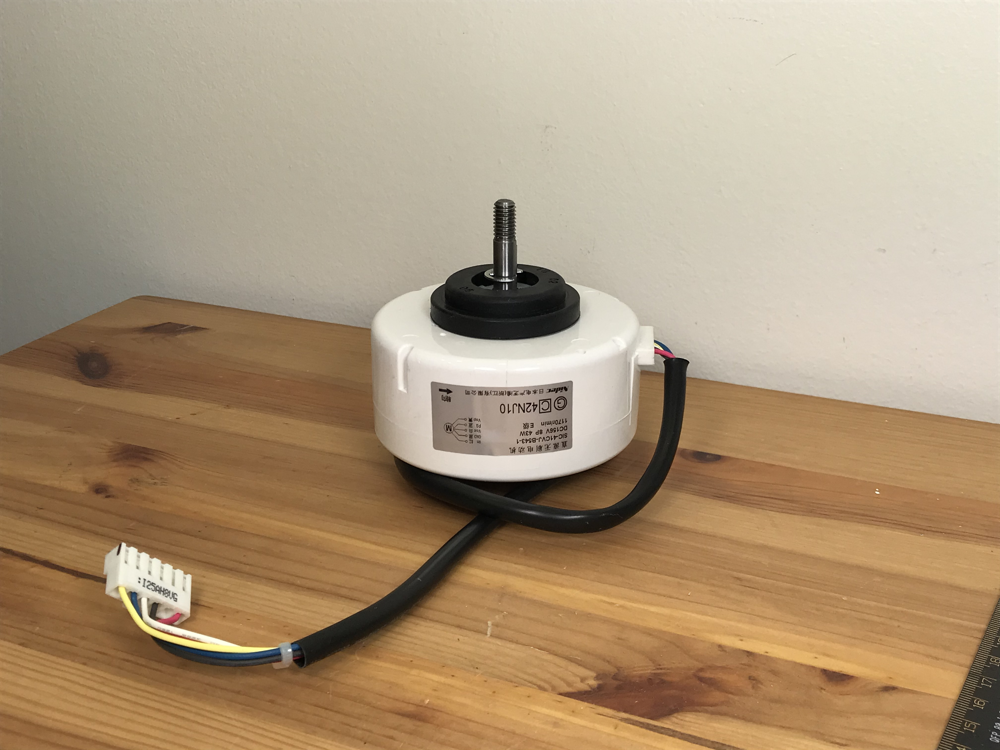

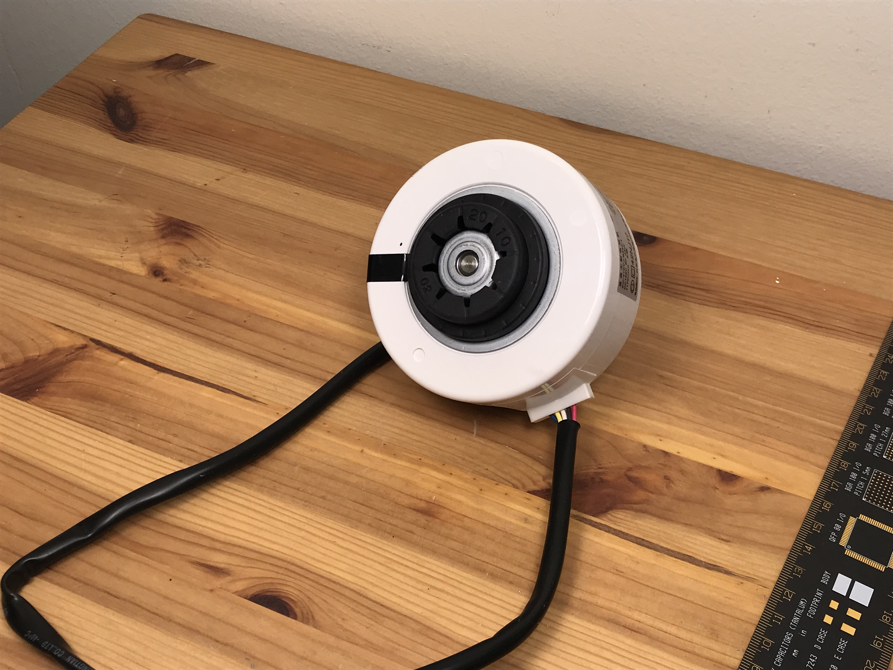

The motor is mounted with two soft rubber grommets.

| **Dimension**                 | **Value**                                                    |
| ----------------------------- | ------------------------------------------------------------ |
| Motor Outer Diameter          | 92mm                                                         |
| Motor Case Length             | 41mm                                                         |
| Motor Length (Incl. Bearings) | 59mm                                                         |
| Motor Shaft                   | 15mm from bearing, then threaded/halfmoon. 31mm total, 11mm to circlip. |
| Bushing Base to Bushing Base  | 53mm                                                         |
| Bushing Diameter (both)       | 40mm. This is the diameter of the first "step" of both bushings. |
| Bushing Depth                 | 5mm front, 8mm back. Measured from outer face of bushing to end of first "step". |

The fan is about 247mm in diameter, and 95mm wide. The hub is offset from the base 27mm, followed by a 12mm tall hub bore with a diameter of 8mm. The hub requires a half-moon shaft and a spring washer/nut to secure. It is made of a rigid and presumably brittle plastic - looks like there isn't glass fiber reinforcement. Some users on Amazon report that the fan can explode or shatter and lose blades after some use. 

Because the blades are wide, the fan is fairly quiet. While not entirely inaudible at the lowest setting, the fan does not make an offensive sound with no prominent tones, and is easily ignored in a room of moderate size. Airflow is sufficient at low. 

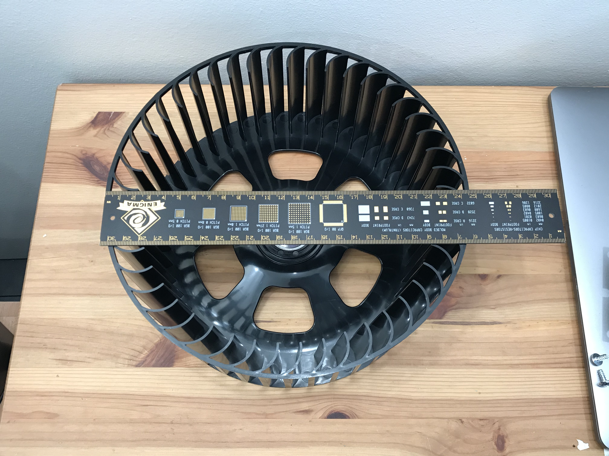

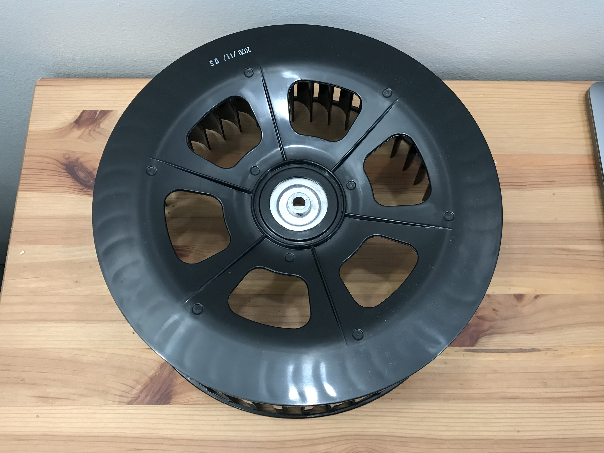

The fan has a slight wobble to it, which will also cause the purifier to wobble slightly at speed. 

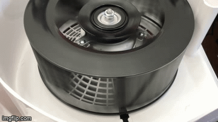

## Electronics

The Coway uses two main boards. The ionizer is operated off the AC mains, the fan motor is operated from the rectified AC mains, and the rest of the electronics are isolated from the AC mains. There is a 330uF 250V capacitor on the board to supply power to the fan, and it's directly connected across the bridge rectifier.

**Discharge this capacitor IMMEDIATELY upon opening the unit - Dangerous DC voltages are present on this power supply PCB even when unplugged**

The power supply board exposes pins to switch the fan motor on and off, read the 6 pulse per rotation (?) speed sensor/ FG output, switch the ionizer relay, and set the fan speed using PWM. These pins are labelled on the board. This is similar to a normal 4-pin computer fan interface protocol, with some differences.

This makes this air purifier rather hackable - it also supplies 5V 1A, isolated from the mains. You can make a "Y-cable" to plug into the power supply board and communicate with it, or view the communication from the main PCB and the power supply board (though it is really just a signal, there is no digital communication).

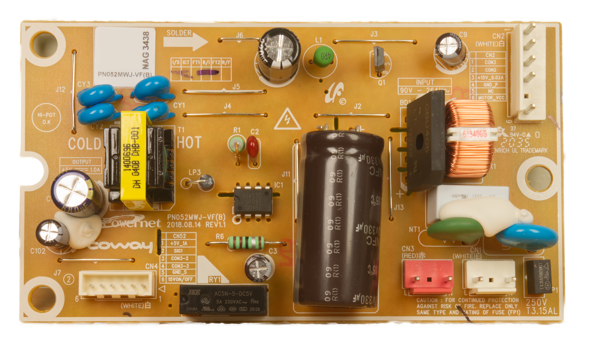

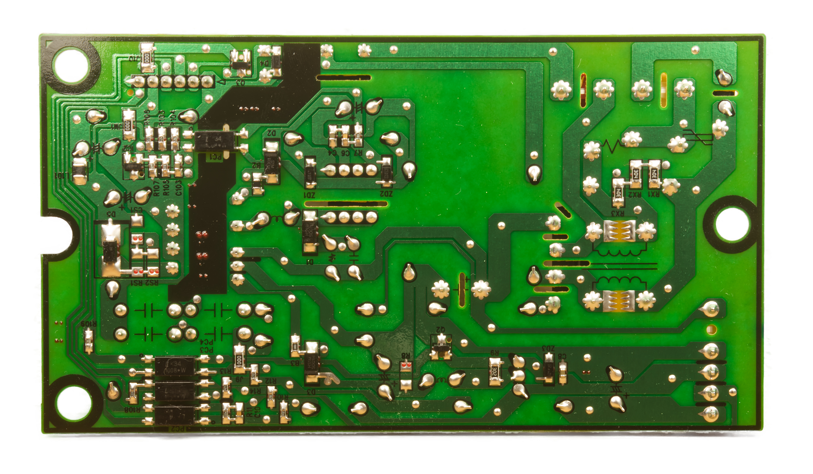

The control board is provided for reference. It is likely that should you require any feature this control board does not implement, you should create your own to interface with the power supply board. You will likely need to find a way to read the speed of the motor and control its output PWM with a closed-loop feedback controller, since these brushless DC motors can have a varying actual speed with line voltage and load. This will also allow you to keep the fan from speeding up too much if the output is blocked, possibly preventing the fan from exploding. 

**Update Jun 2, 2024: I have published a design for an open source replacement main PCB. I don't know if I will be able to provide support for it, but it is provided as-is for your use (https://github.com/larryqiann/AP1512HH-ESP32/)**
The markings on the two main ICs are as follows:

IC1:
D78F0513A
1514XMO17

MYS

IC3:
ATMLH442
02CM B
4W6780

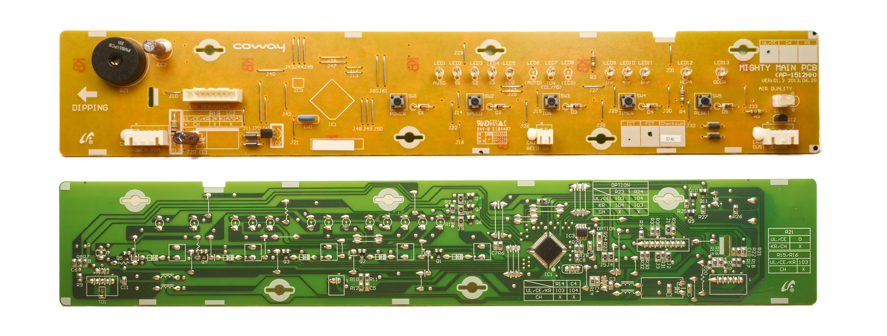

The dust sensor is a Shinyei PPD42. It is not particularly accurate, but is good enough to control the purifier. Most smart air purifiers use Plantower PMS5003,7003,9003 sensors and/or equivalents with an internal fan to provide more accurate readings. 

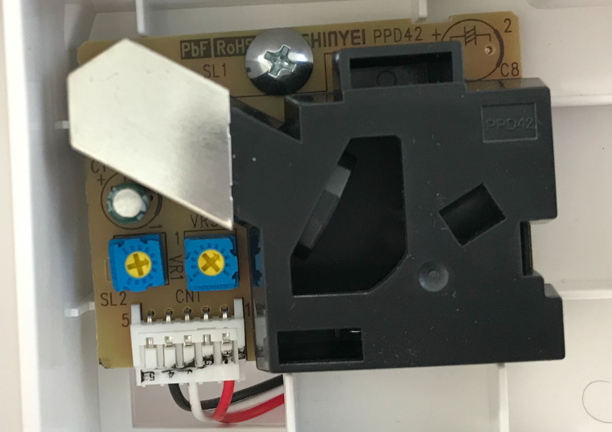

The control board uses a reed switch to sense the presence of the front cover. A strong magnet is needed to activate it e.g. one from a hard drive. **Operation without the cover attached is not officially sanctioned, and is done at your own risk.**

The ionizer is a typical potted high-voltage power supply with a high voltage carbon cable with strands fanning out into the airflow. This will produce some level of ozone, so leave it off if this is undesirable. 

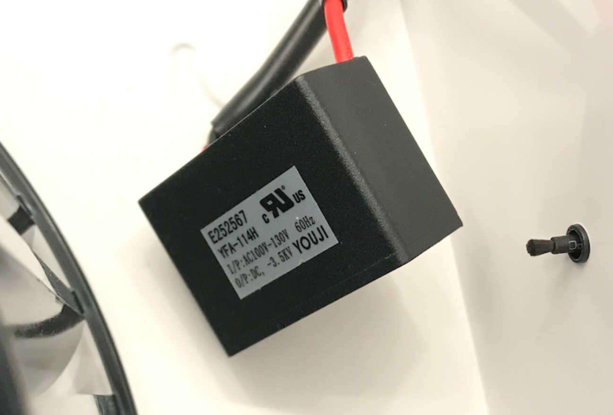

## Info Label

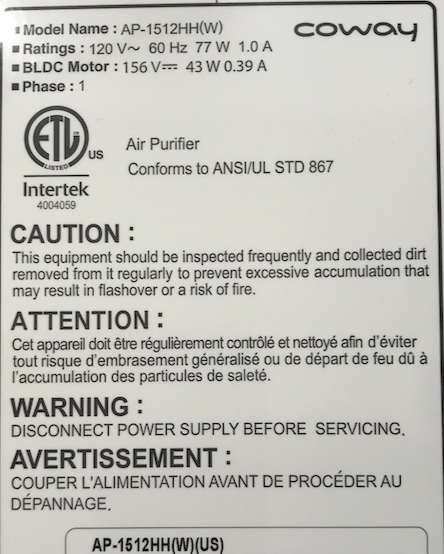

## Questions, Additions, and Comments

Feel free to add questions or content you think was missed, and I'll see if I can add it. You can open an "Issue" on this GitHub repo and I'll see what I can do.

